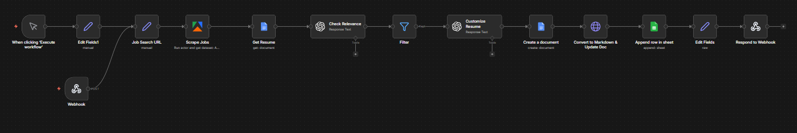
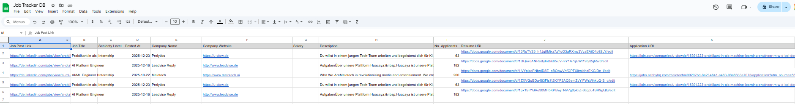

# n8n Job Search Automation Chatbot

Automate and scale your LinkedIn job search process using a **low-code automation pipeline** built with **n8n** and the **Bolt platform**. This workflow scrapes jobs, evaluates relevance using AI, generates customized resumes, and logs structured job data for tracking and applications.

---

## 🚀 Project Overview

This project implements an **end-to-end job search automation system** powered by low-code tools.  
Given a LinkedIn Job Search URL, the system:

- Scrapes relevant job postings using Apify  
- Retrieves the user’s resume from Google Docs  
- Uses AI to evaluate job–resume relevance  
- Generates customized, job-specific resumes  
- Stores structured job data in Google Sheets  
- Returns a clean, human-readable job summary in a chatbot UI

👉 The UI was built using the **Bolt platform**, and the entire project demonstrates **efficient use of low-code platforms** (**n8n + Bolt**) to design scalable automation workflows.

This project also serves as a **template for reusable job-search automation solutions for clients**.

---

## 🧩 Workflow Architecture

The automation is orchestrated in **n8n** using the following steps:

1. **Job Search Input (Bolt UI)** — User submits a LinkedIn job search URL  
2. **Scrape Jobs (Apify)** — Extract job listings and metadata  
3. **Retrieve Resume (Google Docs)** — Load base resume  
4. **AI Relevance Matching** — Compare resume to each job description  
5. **Filter Relevant Jobs** — Remove non-matching roles  
6. **AI Resume Customization** — Generate tailored resumes per job  
7. **Create Google Docs Output** — Save resumes in Markdown-formatted files  
8. **Append Job Data to Google Sheet** — Store full details in a google doc (`Job Tracker DB`), with following columns:
   ```
   Job Post Link | Job Title | Seniority Level | Posted At | Company Name | Company Website | Salary | Description | No. Applicants | Resume URL | Application URL
   ```

9. **Chatbot UI Summary (Bolt App)** — Displays a summarized version of the retrieved job details :
   - Job Title  
   - Company Name  
   - Job Post Link  

---

## 💬 Chatbot URL

Access the live chatbot UI here:  
👉 **https://configurable-n8n-cha-jiye.bolt.host/**

---

## 🖼 Workflow Diagram



---

## 🖥 Application Screenshot


---

## 📊 Google Sheet — Appended Rows View

The workflow appends all retrieved job details to a Google Sheet (`Job Tracker DB`).  



---

## 📦 Outputs

This workflow produces:

- ✔ Filtered list of relevant job opportunities  
- ✔ Customized resumes for each shortlisted role  
- ✔ Structured application log in Google Sheets  
- ✔ Clean summary table in the chatbot UI  

---

## 🛠 Tech Stack & Platforms

- **n8n (Low-code workflow automation)**  
- **Bolt Platform (UI & Chatbot Interface)**  
- **Apify (LinkedIn job scraping)**  
- **Google Docs & Sheets (Resume + Job Database)**  
- **AI Resume Processing (relevance scoring & tailoring)**  

> The solution highlights the power of **low-code engineering** to rapidly build scalable and production-ready automation systems.

---

## 🧪 Reuse & Extension

This template can be adapted for:

- Multi-platform job search aggregation  
- Automated job application pipelines  
- Resume personalization at scale  
- Client-ready automation products  
- Enterprise workflow prototypes  

---

## 📝 License

This project is provided as a template for learning and customization.

---
